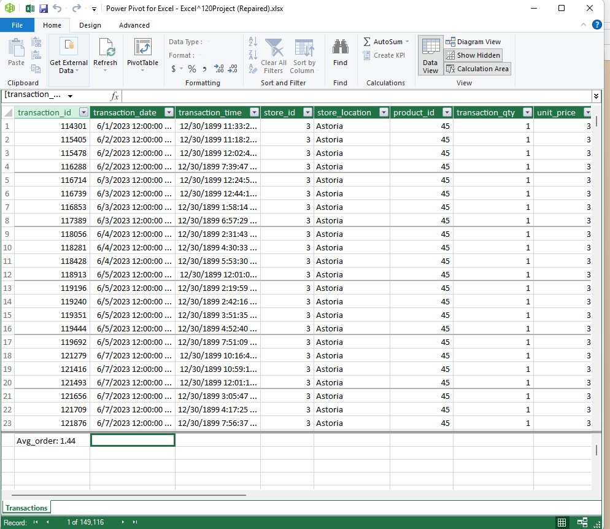
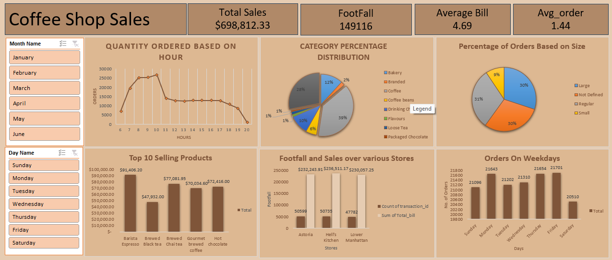

# 📊 Excel Data Analysis Project

---

## 📝 Summary

This project showcases how to use **Microsoft Excel** for professional data analysis using **Power Query**, **Pivot Tables**, **Slicers**, and a custom-built **Dashboard**. It’s a beginner-friendly project that demonstrates real-world data handling from import to insight.

---

## 🔧 What I Did

- Cleaned and transformed raw data using **Power Query**
- Used **Pivot Tables** to create dynamic summaries
- Added **Slicers** for interactive filtering
- Built a **Dashboard** to visually present key insights
- Organized the workbook into clean, readable sections

---

## 📚 What I Learned

- Automated data preparation with Power Query
- Created visual summaries with Pivot Tables and charts
- Added interactive controls (Slicers) to explore the data
- Designed a professional **Excel Dashboard** for easy storytelling

---

## ✅ Result

A clean, interactive, and user-friendly Excel workbook:
- Automated cleaning with Power Query  
- Dynamic filtering with Slicers  
- Professional dashboard view for at-a-glance insights

Perfect for reports, presentations, or internal use cases.

---

## 🌄 Screenshots

### 📥 Power Query Data Cleaning

### 📊 Final Dashboard View

---

## 🌱 Future Improvements

- Add conditional formatting for key thresholds
- Include buttons to reset filters in the dashboard
- Expand dashboard with KPIs and trend lines
